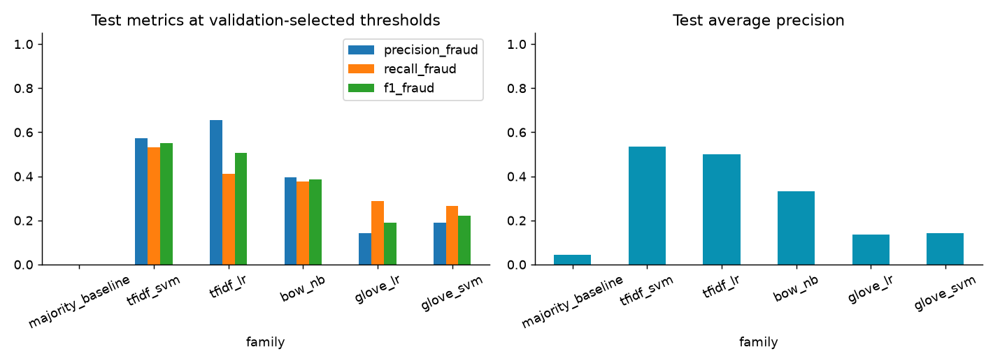
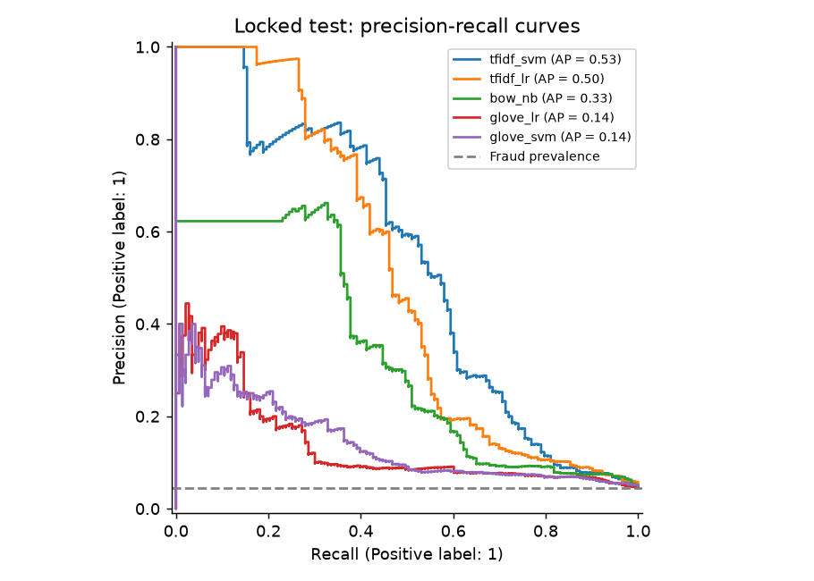
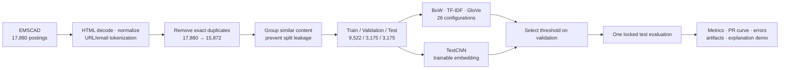
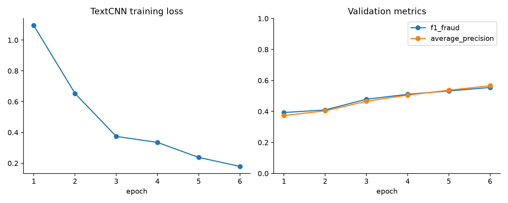

<div align="center">

# 🛡️ Job Scam Detection

### NLP pipeline phát hiện tin tuyển dụng có dấu hiệu lừa đảo

[](#quickstart)
[](#mô-hình)
[](#textcnn)
[](#kiểm-chứng)
[](#kết-quả)

*Bài tập lớn môn Học máy · Khoa KH&KT Máy tính · ĐHQG-HCM*

</div>

> **TL;DR** — Pipeline tái lập được để sàng lọc tin tuyển dụng tiếng Anh đáng ngờ. Dự án so sánh **26 cấu hình BoW/TF-IDF/GloVe** với **TextCNN**, chống rò rỉ giữa các tin trùng nội dung, chọn ngưỡng trên validation và chỉ mở test một lần. Kết quả tốt nhất: **TF-IDF bigram + Linear SVM**, đạt **F1 lớp gian lận 0.5507** và **Average Precision 0.5348**.

## Điểm nổi bật

| | |
|---|---|
| 📦 **Dữ liệu có kiểm toán** | EMSCAD gồm 17.880 tin; loại 2.008 bản sao văn bản chính xác trước khi chia tập. |
| 🛡️ **Chống leakage** | Gom nhóm liên thông theo `description`/`company_profile` đã chuẩn hóa, rồi chia bằng `StratifiedGroupKFold`. |
| 🧪 **Thực nghiệm có kỷ luật** | Vocabulary, IDF, scaler và ngưỡng chỉ fit/chọn trên train + validation; test không tham gia chọn mô hình. |
| 🧠 **So sánh công bằng** | BoW, TF-IDF, GloVe pooling và TextCNN cùng dùng một giao thức dữ liệu, seed và metric. |
| 🔎 **Có thể giải thích** | Demo tuyến tính hiển thị các cụm từ đóng góp vào điểm dự đoán. |
| ✅ **Có thể chạy lại** | Notebook độc lập, manifest/checksum, artifacts, unit tests và script đóng gói. |

## Kết quả

Sau khi khóa cấu hình và ngưỡng **trên validation**, test được mở đúng một lần: 3.175 tin, trong đó 143 tin gian lận.

| Hạng | Biểu diễn + mô hình | Precision | Recall | F1 gian lận | AP | ROC-AUC |
|:--:|---|--:|--:|--:|--:|--:|
| 🥇 | **TF-IDF bigram + Linear SVM** | **0.5714** | **0.5315** | **0.5507** | **0.5348** | **0.8653** |
| 🧠 | TextCNN | 0.5377 | 0.3986 | 0.4578 | 0.4890 | 0.8728 |

**Mô hình tốt nhất:** 76 TP · 57 FP · 67 FN · 2.975 TN. Accuracy không phải metric chính vì dữ liệu mất cân bằng; trọng tâm là **F1 lớp gian lận** và **Average Precision**.

<p align="center">
  
  
</p>

## Pipeline



| Tập | Số mẫu | Số gian lận | Mục đích |
|---|--:|--:|---|
| Train | 9.522 | 427 | Fit vocabulary/IDF/scaler và huấn luyện |
| Validation | 3.175 | 143 | Chọn cấu hình, epoch và ngưỡng |
| Test | 3.175 | 143 | Đánh giá cuối sau khi khóa quyết định |

Văn bản ghép từ `title`, `company_profile`, `description`, `requirements`, `benefits`. Các cột `fraudulent`, `job_id` và dự đoán có sẵn **không** được đưa vào đặc trưng.

## Mô hình

| Họ biểu diễn | Cấu hình | Bộ phân loại |
|---|---|---|
| Bag-of-Words | unigram, `alpha ∈ {0.1, 1.0}` | Multinomial Naive Bayes |
| TF-IDF | unigram/bigram, có/không stopwords | Logistic Regression, Linear SVM (`C ∈ {0.5, 2.0}`) |
| GloVe | frozen 50D, mean/train-IDF pooling | Logistic Regression, Linear SVM (`C ∈ {0.1, 1, 10}`) |

- Tổng cộng **26 cấu hình** truyền thống.
- Candidate thắng validation: **TF-IDF bigram + Linear SVM**, `C=2`, `class_weight="balanced"`.
- Ngưỡng tối ưu trên validation; tie-break dùng AP rồi thứ tự candidate cố định.

### TextCNN

TextCNN là benchmark học sâu mở rộng, không được dùng để che kết quả mô hình truyền thống.

| Thành phần | Cấu hình |
|---|---|
| Vocabulary | 30.000 token, xây dựng **chỉ từ train** |
| Input | 300 token, padding/truncation cố định |
| Embedding | 100 chiều, trainable |
| Convolution | kernels 3/4/5, mỗi kernel 96 channels |
| Head | global max pooling → dropout 0.5 → sigmoid |
| Training | AdamW, LR 0.001, batch 128, seed 42 |
| Selection | epoch 6, threshold 0.6019 từ validation |

TextCNN đạt F1 0.4578, thấp hơn TF-IDF + Linear SVM ở lần chạy hiện tại. Kết luận này được giữ nguyên thay vì chọn lại sau khi nhìn test.

<p align="center">
  
</p>

## Quickstart

### Chạy local

Yêu cầu Python 3.12+ và Internet lần đầu chạy để tải EMSCAD/GloVe. GPU không bắt buộc.

```powershell
git clone https://github.com/duty00/job-scam-dectection.git
cd job-scam-dectection

python -m venv .venv
.venv\Scripts\Activate.ps1
python -m pip install -r requirements.txt
python run_experiments.py

# Benchmark deep learning (tùy chọn)
python -m pip install -r requirements-deep-learning.txt
python run_deep_learning.py
```

### Google Colab

1. Upload [`notebooks/Job_Scam_Detection.ipynb`](notebooks/Job_Scam_Detection.ipynb) vào Colab.
2. Chọn **Runtime → Run all**.
3. Xem EDA, bảng điểm, biểu đồ và demo dự đoán ở cuối notebook.

Notebook tự mang module nguồn kèm SHA-256; không cần mount Drive, Kaggle credentials hay upload thêm source. Thời gian chạy thực tế nằm trong [`results/run_summary.json`](results/run_summary.json).

## Kiểm chứng

```powershell
# Unit tests cho pipeline
python -m unittest discover -s tests -v

# Sinh và chạy notebook sạch
python tools/build_notebook.py
python tools/execute_notebook.py

# Kiểm tra artifacts, metrics và đóng gói
python tools/validate.py
python tools/package.py
```

Lần kiểm tra đã lưu chạy đủ **7/7 unit tests** và notebook clean **10/10 code cells**.

| Artifact | Nội dung |
|---|---|
| [`results/data_manifest.json`](results/data_manifest.json) | Nguồn dữ liệu, checksum, thống kê nhãn gốc |
| [`results/data_audit.json`](results/data_audit.json) | Dòng bị loại, nhóm trùng và tỷ lệ split |
| [`results/validation_scores.csv`](results/validation_scores.csv) | Điểm và thời gian fit của mọi cấu hình |
| [`results/selection.json`](results/selection.json) | Candidate/ngưỡng đã khóa trước test |
| [`results/test_scores.csv`](results/test_scores.csv) | Chỉ số test và TP/FP/FN/TN |
| [`results/deep_learning_summary.json`](results/deep_learning_summary.json) | Tham số và kết quả TextCNN |

## Cấu trúc repository

```text
├── notebooks/       # Notebook gốc và notebook đã thực thi
├── modules/         # Data · EDA · embeddings · training · evaluation · inference
├── tests/           # Leakage, threshold, artifacts, recomputed metrics
├── tools/           # Build notebook, execute, validate, package
├── results/         # Bảng điểm, audit, biểu đồ và metadata lần chạy
├── features/        # Manifest và vocabulary TextCNN
├── reports/         # Báo cáo PDF (không version artifact nặng)
├── run_experiments.py
└── run_deep_learning.py
```

Raw data, vector GloVe, model đã fit, features lớn, ZIP và prediction per-row được bỏ khỏi Git để repo gọn. Pipeline tái tạo các artifact này khi chạy.

## Giới hạn và sử dụng có trách nhiệm

- Dữ liệu tiếng Anh lịch sử (2012–2014), chưa đánh giá cho tiếng Việt hay thị trường hiện tại.
- Điểm mô hình là tín hiệu sàng lọc, **không** xác minh doanh nghiệp hoặc kết luận một tổ chức lừa đảo.
- Group split giảm leakage từ văn bản tương tự, không đảm bảo tách tuyệt đối mọi công ty/tin viết lại.
- GloVe pooling mất thứ tự từ; TextCNN hiện là benchmark nhỏ, chưa phải mô hình production.
- Validation dùng để chọn hyperparameter lẫn threshold; chưa dùng nested cross-validation.

## Tài liệu tham khảo

1. Vidros et al. (2017), *Automatic Detection of Online Recruitment Frauds*. [DOI](https://doi.org/10.3390/fi9010006)
2. [EMSCAD / Real or Fake Fake Jobposting Prediction](https://www.kaggle.com/datasets/shivamb/real-or-fake-fake-jobposting-prediction)
3. Pennington, Socher & Manning (2014), [GloVe](https://nlp.stanford.edu/projects/glove/)
4. [scikit-learn model evaluation](https://scikit-learn.org/stable/modules/model_evaluation.html)

---

<div align="center"><sub>Được xây dựng cho học phần Học máy. Hãy chạy lại, đọc và hiểu pipeline trước khi sử dụng kết quả.</sub></div>
